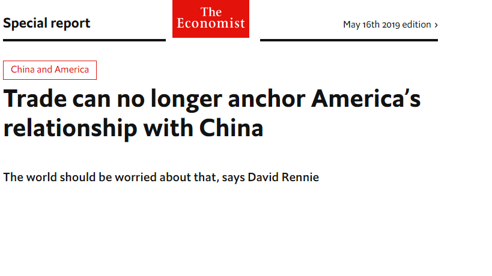
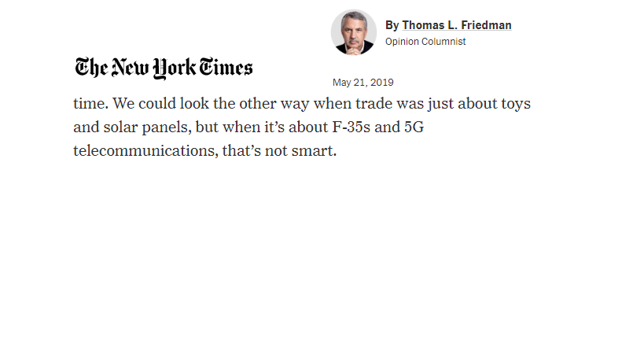

```{r xaringan-themer, include=FALSE, warning=FALSE}
library(armcompanion)
library(xaringanthemer)
style_solarized_light(
  code_font_family = "Fira Code",
  text_font_size = "2rem",
  colors = c(blue = "blue"),
  code_font_url = "https://cdn.jsdelivr.net/gh/tonsky/FiraCode@2/distr/fira_code.css"
)
```


# Recent US-China conflict  
<!-- include an image here, if you have a GitHub account use your profile pic! -->


```{r photo1, echo = FALSE}
 # update USERNAME here
```

---
# Recent US-China conflict  
<!-- include an image here, if you have a GitHub account use your profile pic! -->


```{r photo2, echo = FALSE}
 # update USERNAME here
```


---

# Bilateral trade and costly conflict

--

Current studies focus on costs

--

Empirically, conditional pacifying effects


--

Different commodities entail different costs

- Easy to plunder

- Easy to find alternatives (highly elastic)

---

class: center, middle

# 5G technology or microchips are neither easily appropriable nor highly elastic


---

class: center, middle

# But they can shift military power


---
# Concept of security externality

States' increased abilities to translate trade gains
into (latent) military power due to the expansion of trade


---

# Theory

--

Peace-promoting when relative externality is at the extremes

--

Conflict-aggravating when at a mid-range

---

# Empirics

Sample: .blue[rivalry]

Outcome: MIDs

IV: trade, .blue[externality]

Controls: total trade, power ratio, distance, alliance, democracy, Cold war


---

# Externality

--

Strategic goods


Manufactured goods


Trade networks (integration)

--

$$\scriptsize \begin{equation}
		\texttt{Externality} = \texttt{$\sum_{i}^{} \texttt{Strategic goods}_{i} \times \texttt{Integration}_{i}$}		
\end{equation}$$


---
# Externality  
<!-- include an image here, if you have a GitHub account use your profile pic! -->


```{r echo=FALSE, message=FALSE}
magick::image_read_pdf("externalityplots.pdf",
                       pages = 1)
```


---
# Main result  
<!-- include an image here, if you have a GitHub account use your profile pic! -->


```{r echo=FALSE, message=FALSE}
magick::image_read_pdf("marginplot.pdf",
                       pages = 1)
```

---
# Examples  
<!-- include an image here, if you have a GitHub account use your profile pic! -->


```{r echo=FALSE, message=FALSE}
magick::image_read_pdf("midrangeplot.pdf",
                       pages = 1)
```


---
# Conclusion


--

Scope condition (reversed)


--

Current focus on costs misses externatlity

--

Power shift over time is critical